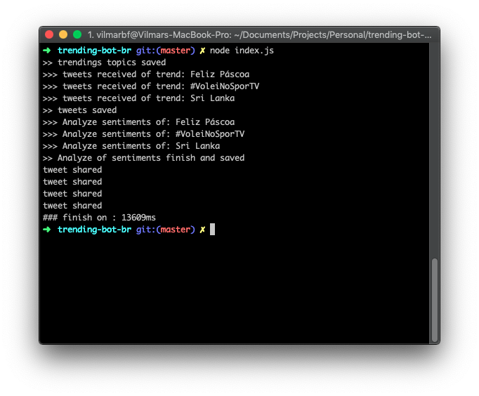

# Trending Bot
POC about a bot that get the trending topics of twitter and analyze the feeling over tweets.

### Purpose
The purpose of this PoC is create bots that get tweets about trendings topics on Twitter and analyze the feelings about them and then post on a Twitter profile.

### Technology
- Node.js
- IBM Watson (Natural Language Understanding)

### Twitter
Twitter of bot
[@t4rsb0t](https://twitter.com/t4rsb0t)

### Screenshots

